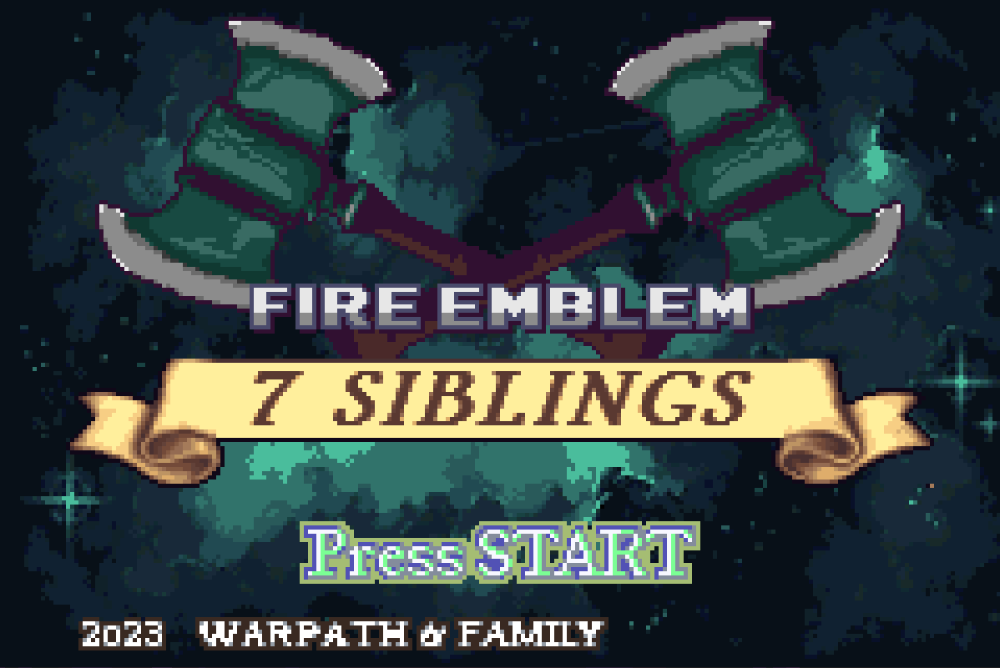
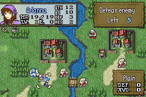
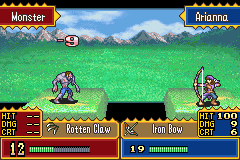
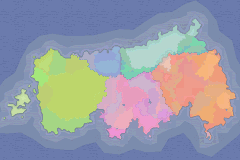
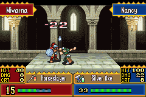
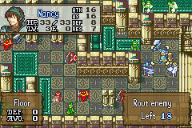
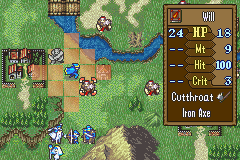

"Fire Emblem: 7 Siblings" is a romhack of "Fire Emblem: The Sacred Stones" for the GameBoy Advance. It features a fully custom campaign created by me, with much support and many assets used provided by the FEUniverse community.

<a href="https://feuniverse.us/t/fe8-fire-emblem-7-siblings-complete-let-the-feast-begin/5015">Link to FEUniverse page</a>

### Overview 

The continent has been at an uneasy peace following the fierce Magus war. However, 25 years after the fact, strife bubbles once again. Unanswered questions from the previous conflict abound, with dark forces on the move. One family finds itself at the center of the intrigue. An ailing mother and her seven children must navigate the trials that await them, while clinging to each other as they never have before...

### Download/Helpful Links (Apply .ups file to clean FE8U Rom)

<a href="https://www.dropbox.com/s/40g41dvx7pb3sjv/7S_COMPLETE.zip?dl=0">7 Siblings COMPLETE Download</a>

Current Version: 1.5

Note that saves from version 1.1 and earlier will not be compatible with version 1.2 of the game and beyond

<a href="https://mgba.io/downloads.html">Download latest version of mGBA</a>

<a href="https://feuniverse.us/t/how-to-patch-a-rom-v5/10329">How to patch a ROM</a>

<a href="https://www.marcrobledo.com/RomPatcher.js/">Browser-based ROM patcher</a>

### Discord Server Link

<a href="https://discord.com/invite/UVVRkcb">7 Siblings Discord</a>

### Screenshots

 
 
 

